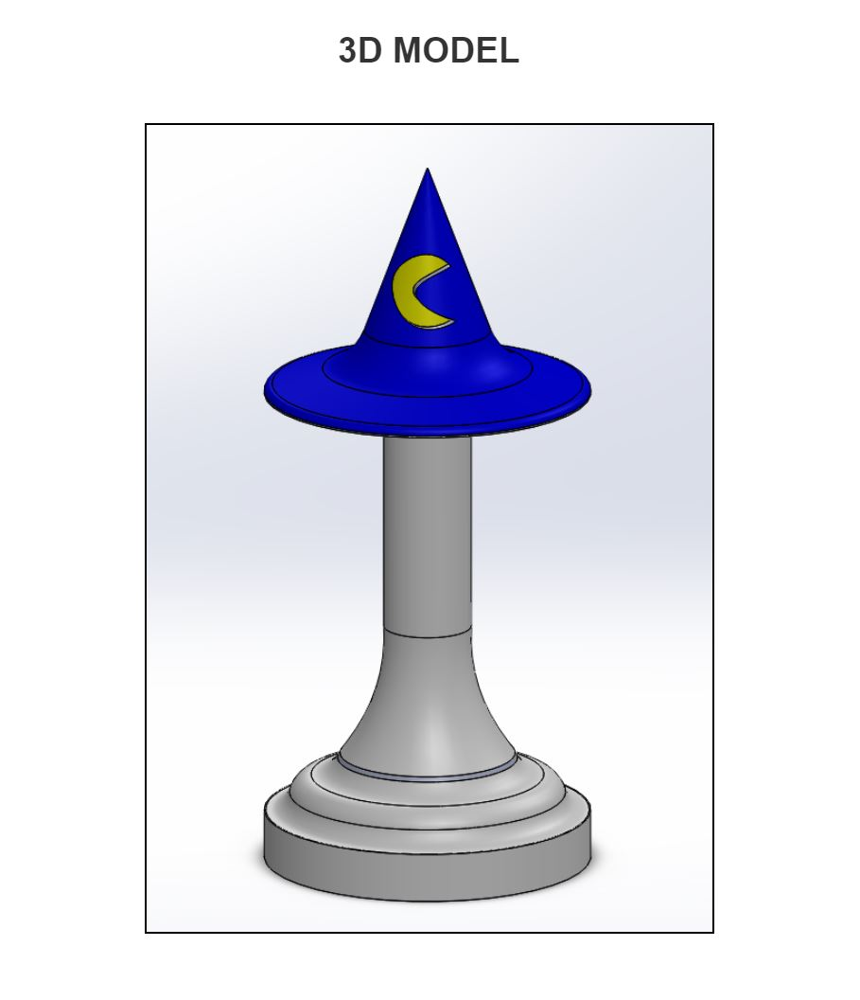
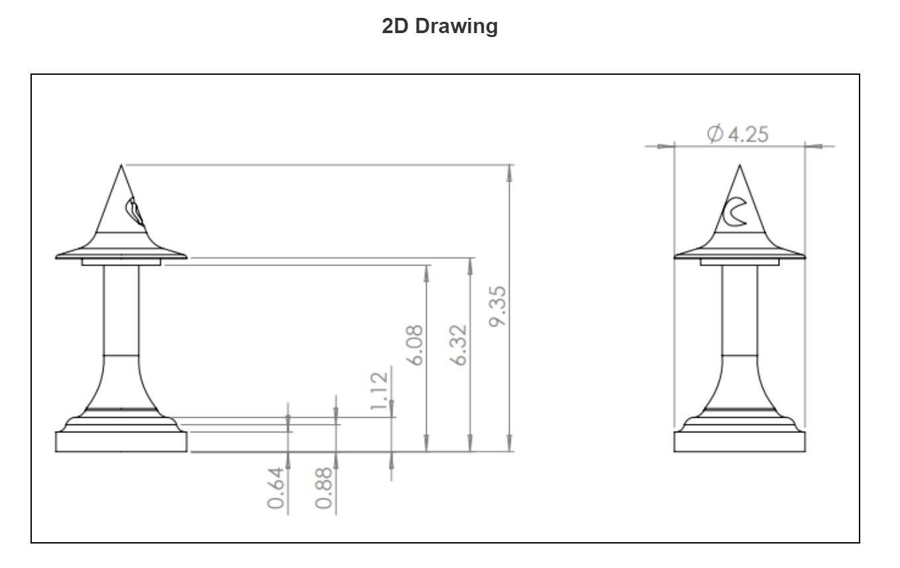
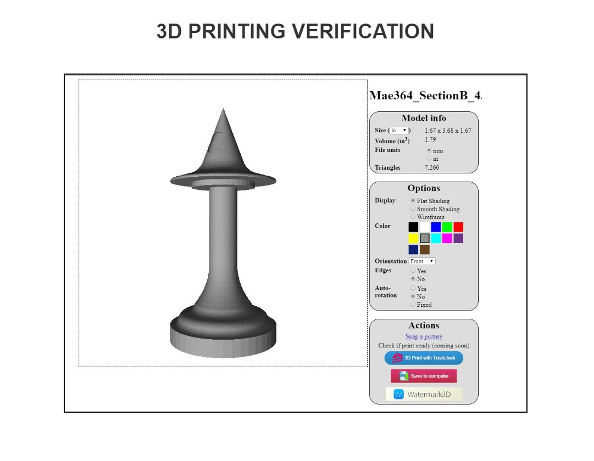
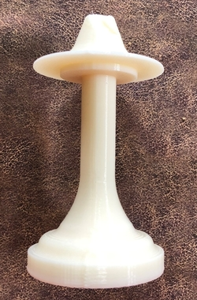
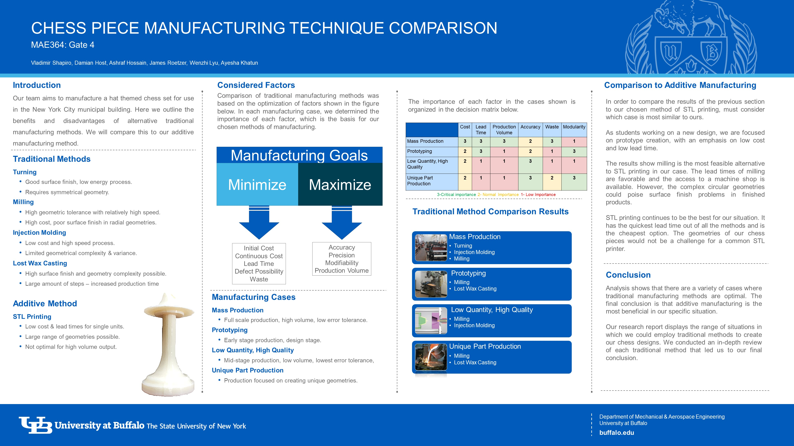

# Prototype_Using_Additive_Manufacturing_Method
## Objective
Our team manufactured a hat themed chess set for use in the New York City municipal building using STL printing resources available at'Dogital Manufacturing Lab' at University at BUffalo.The goal of our team in this project was to create a chess set that is creative, intuitive, and within the scope of our resources.STL printing is an additive manufacturing method very useful for rapid prototyping. Therefors, We choose STL printing method over other traditional manufcaturing methods.

## Decision Process
we have completed three gate steps towards the final product. In the first, we specified our theme and outlined potential manufacturing processes for our chess pieces. Next, we brainstormed ideas for specific hat themed chess pieces by creating sketches of six full sets of chess pieces. In our last gate, we performed analysis on the designs to reach a final decision on the chess piece we would manufacture. All the reports from these three steps of decesion making can be found in the github repo of this project. 

After brainstorming six different designs for our chess pieces, we had to narrow it down to one piece. In order to make this decision, we created a decision matrix as below to look at all six of the designs from engineering desisgn perspective:

we used a color ranking system in our decision matrix. Green means that the design fits very well in a certain category and it cannot be better. Yellow signals that the design is just average and can be worked upon, but is not that bad. Red tells us that the design is very bad for a certain category and would need significant work to be better. By using this ranking system we were able see which design was best fit for next step of manufacturing. The complexity of this design is simple as it is only a wizards hat on a podium. Following is the CAD model and engineering drawing of our deisgn for chess piece 'Queen': 

The next step was to verify the deisgn for 3D printing:

Upon sucessful completion of the 3D printing, we had our chess piece protype made using plastic. A picture of our printed chess piece can be seen below: 

Following is also a poster that we presented to explain what other different traditional manufacturing processes could be used for our protype and the advantages of using STL printing above all: 

